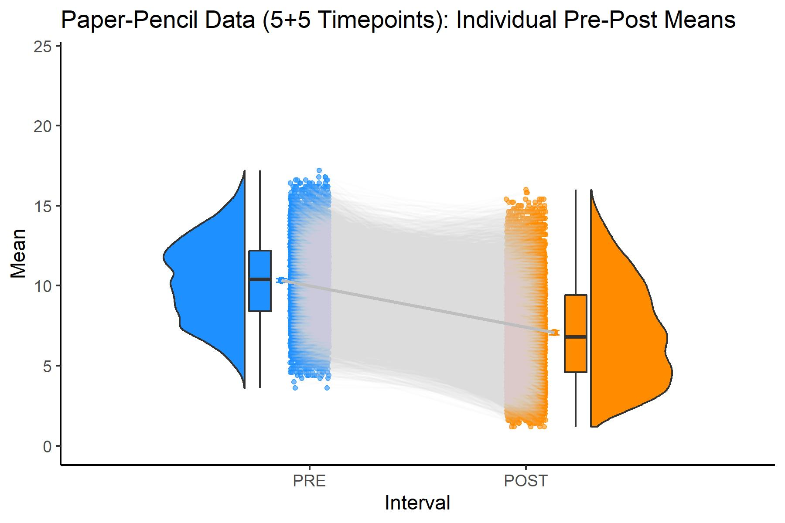

<!-- Required to number equations in HTML files -->
<script type="text/x-mathjax-config">
MathJax.Hub.Config({
  TeX: { equationNumbers: { autoNumber: "AMS" } }
});
</script>

<!--
```{r, include=FALSE, cache=FALSE, eval=FALSE}
#knitr::purl("PP_Stichprobenvergleiche_d0.92.Rmd", output = "PP_Stichprobenvergleiche_d0.92.R", documentation = 2)

#knitr::read_chunk("PP_Stichprobenvergleiche_d0.92.R")
```
-->

```{r echo=FALSE}
load("data/cor_07_k20/PP_30.30.RData")
PP_30.30 = PP_30.30 %>%
  as_tibble()

load("data/cor_07_k20/PP_5.5.RData")
PP_5.5 = PP_5.5 %>% 
  dplyr::rename(ID_orig = ID) %>% 
  filter(ID_orig %in% PP_30.30$ID1_PRE)

load("data/cor_07_k20/PP_1.1.RData")

pre_30mzp = c("PRE1_1","PRE1_2","PRE1_3","PRE1_4","PRE1_5",
            "PRE1_6","PRE1_7","PRE1_8","PRE1_9","PRE1_10",
            "PRE1_11","PRE1_12","PRE1_13","PRE1_14","PRE1_15",
            "PRE1_16","PRE1_17","PRE1_18","PRE1_19","PRE1_20",
            "PRE1_21","PRE1_22","PRE1_23","PRE1_24","PRE1_25",
            "PRE1_26","PRE1_27","PRE1_28","PRE1_29","PRE1_30")

post_30mzp = c("POST1_1","POST1_2","POST1_3","POST1_4","POST1_5",
             "POST1_6","POST1_7","POST1_8","POST1_9","POST1_10",
             "POST1_11","POST1_12","POST1_13","POST1_14","POST1_15",
             "POST1_16","POST1_17","POST1_18","POST1_19","POST1_20",
             "POST1_21","POST1_22","POST1_23","POST1_24","POST1_25",
             "POST1_26","POST1_27","POST1_28","POST1_29","POST1_30")

pre_5mzp = c("PRE1_1","PRE1_2","PRE1_3","PRE1_4","PRE1_5")
post_5mzp = c("POST1_1","POST1_2","POST1_3","POST1_4","POST1_5")

PP_5.5$PRE_Mean = apply(PP_5.5[pre_5mzp], 1, mean)
PP_5.5$POST_Mean = apply(PP_5.5[post_5mzp], 1, mean)
PP_5.5$MeanDiff = PP_5.5$PRE_Mean - PP_5.5$POST_Mean
PP_5.5$ind.pretestSD = apply(PP_5.5[pre_5mzp], 1, sd)
PP_5.5$ind.posttestSD = apply(PP_5.5[post_5mzp], 1, sd)

PP_1.1$Diff = as.numeric(PP_1.1$PRE - PP_1.1$POST)

# Ausschluss von Personen ohne Varianz in min. einem MZP-Intervall

PP_5.5 = PP_5.5 %>% 
  filter(ind.pretestSD != 0 & ind.posttestSD != 0)

PP_30.30 = PP_30.30 %>% 
  filter(ind.pretestSD != 0 & ind.posttestSD != 0)


PP_5.5 = PP_5.5 %>% 
  filter(ID_orig %in% PP_30.30$ID1_PRE)

PP_30.30 = PP_30.30 %>% 
  filter(ID1_PRE %in% PP_5.5$ID_orig)

PP_1.1 = PP_1.1 %>% 
  filter(ID_orig %in% PP_5.5$ID_orig & ID_orig %in% PP_30.30$ID1_PRE)


PP_5.5 = PP_5.5 %>% 
  add_column(., .before = "ID_orig", ID = 1:nrow(.))

PP_30.30 = PP_30.30 %>% 
  add_column(., .before = "ID1_PRE", ID = 1:nrow(.))

PP_1.1 = PP_1.1 %>% 
  add_column(., .before = "ID_orig", ID = 1:nrow(.))
```

# Results {#results}


All steps of data preparation and statistical analyses were performed using the statistical programming language R [@RCoreTeam.2020]. A complete list of additionally installed packages is provided in Appendix \@ref(session-info).


### Robustness of Results in Random Samples of n = 50 and n = 100 in Comparison to the Population


### Paper-Pencil Scenario


### EMA Scenario


## Pre-Post Differences in Symptom Scores


Plot: Dispersion of symptom scores (nine-item Patient Health Questionnaire, PHQ-9) at pre-treatment (in light bars) and post-treatment scores (in dark bars).

<!--
```{r echo=FALSE, fig.align="center", out.width="75%"}
#knitr::include_graphics("Time Series Dataframes/k20_PP_5.5_Pre-Post_Box_Violin.jpg")

```

\caption{\textit{A Figure}} \label{fig:fig1}
\begin{center}
  \includegraphics[width=0.75\linewidth]{data/Time Series Dataframes/k20_PP_5.5_Pre-Post_Box_Violin_Mean+CI}
\end{center}
-->


### Paper-Pencil Scenario


### EMA Scenario


## Comparison of Classification Methods


### Paper-Pencil Scenario

Standard Questionnaire vs. Intense Questionnaire


### EMA Scenario

Standard EMA vs. Intense EMA


## Baseline Dependence by Method


Barplot with 95% CIs: x = PHQ Baseline Severity Categories, y = MeanDiff/PC/RCI...


## False-Positive Rate and Specificity

False-positive rates and the specificity of clinical change methods were investigated in questionnaire and EMA scenarios with overall within-subjects effect sizes of Cohen´s _d_ $\approx$ 0, representing the scores of a control group in a clinical trial. Although some participants in these simulated scenarios showed a substantial symptom improvement or deterioration, the overall pre-post symptom changes were closely distributed around 0, with the vast majority of cases showing no meaningful changes in absolute scores. The main advantage of using zero-effect data sets for this analysis is that the absence of a general treatment effect, along with equally distributed random positive and negative effects, enables the a-priori assumption that proportions of cases identified as changed should be minimal in the most specific calculation methods. The respective cases would only constitute false-positive classifications (i.e. both classifications of improvement and of deterioration), as the number of truly changed participants would be _p_ = _tp_ + _fn_ = 0, implying that cases of true change could neither be detected (i.e. _tp_ = 0) nor overlooked (i.e. _fn_ = 0) in these scenarios. Following from their definitions, classification sensitivity (see Equation \@ref(eq:sensitivity)) could not be calculated under these conditions, while the classification specificity (see Equation \@ref(eq:specificity)) could be appropriately estimated with regard to the known _ground truth_ of the whole sample consisting of only negative (i.e. non-changed) cases.


The _false-positive rate (FPR)_ is given by:
\begin{equation}
FPR = \frac{fp}{n} = \frac{fp}{fp + tn} (\#eq:fpr)
\end{equation}

\par
Hence, classification methods can be compared regarding their false-positive rates and their specificity (i.e. probability of true-positive classifications) on the basis of this data source.

\par
The resulting 


### Paper-Pencil Scenario


### EMA Scenario


## Jackknife Resampling of Parameter Estimates


Within the same assessment frequency, the method bias of classifications was up to 19 % (of non-agreement).


### Paper-Pencil Scenario


### EMA Scenario


